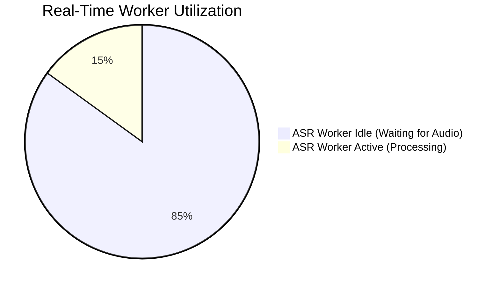
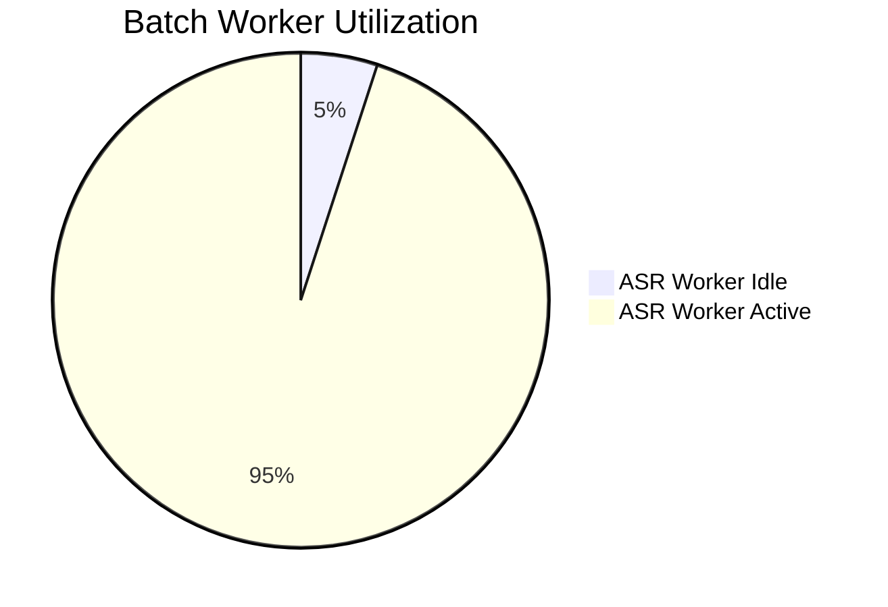
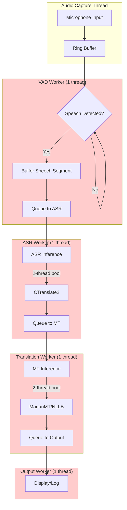
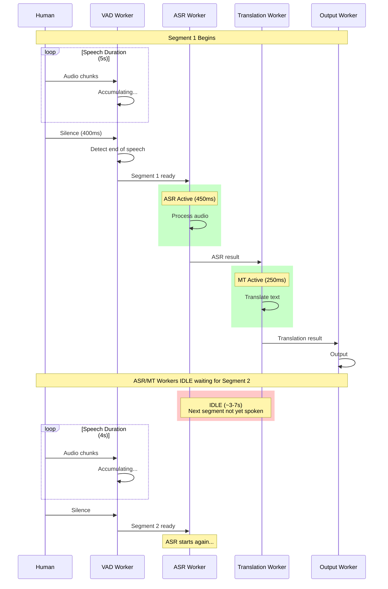
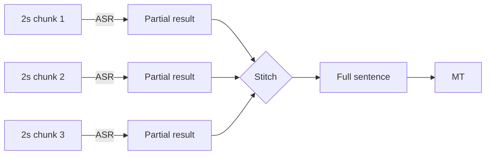
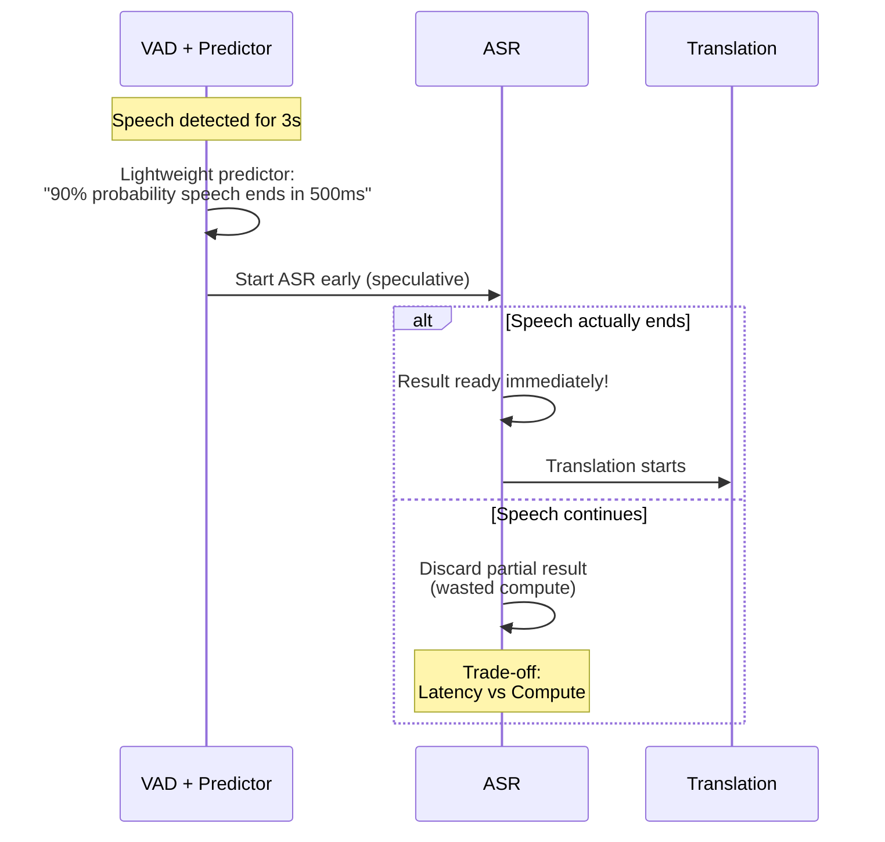

# Overlap Savings Analysis for Real-Time Voice Translation

> **Document Purpose**: Explain why pipeline overlap optimization provides zero benefit for real-time streaming, and identify potential architectural improvements.
> 
> **Target Audience**: AI systems analyzing optimization opportunities
> 
> **Last Updated**: 2026-02-19

---

## 1. Executive Summary

The current parallel pipeline (`orchestrator_parallel.py`) implements worker threads for VAD, ASR, Translation, and Output. However, **overlap savings = 0ms** in real-time streaming mode because the pipeline is fundamentally **I/O bound by human speech speed**, not **compute bound**.

**Key Insight**: Human speech (3-8 seconds per segment) is 5-10x slower than processing time (~0.7 seconds). When ASR finishes segment N, segment N+1 hasn't been fully spoken yet.

---

## 2. Timing Analysis

### 2.1 Real-Time Streaming Timeline

```mermaid
gantt
    title Real-Time Streaming: Sequential by Nature
    dateFormat X
    axisFormat %s
    
    section Human Speech
    Segment 1 (5s speech)       :active, speech1, 0, 5
    Silence (400ms)             :crit, silence1, 5, 5.4
    Segment 2 (4s speech)       :active, speech2, 5.4, 9.4
    
    section VAD Detection
    VAD: Seg 1 detected         :done, vad1, 5, 5.1
    VAD: Seg 2 detected         :done, vad2, 9.4, 9.5
    
    section ASR Processing
    ASR: Process Seg 1 (~450ms) :active, asr1, 5.1, 5.55
    ASR: WAITING (idle)         :crit, asr_wait, 5.55, 9.5
    ASR: Process Seg 2 (~450ms) :active, asr2, 9.5, 9.95
    
    section Translation
    MT: Translate Seg 1 (~250ms):active, mt1, 5.55, 5.8
    MT: WAITING (idle)          :crit, mt_wait, 5.8, 9.95
    MT: Translate Seg 2 (~250ms):active, mt2, 9.95, 10.2
```

**Observation**: Notice the large **idle gaps** (red segments). When ASR finishes at T=5.55s, the next segment hasn't even started being spoken (starts at T=5.4s, but VAD needs silence to detect it at T=9.4s).

### 2.2 Batch Processing Timeline (For Comparison)

```mermaid
gantt
    title Batch Processing: True Parallelism Possible
    dateFormat X
    axisFormat %s
    
    section VAD (File Scan)
    Detect ALL segments         :done, vad_batch, 0, 2
    
    section ASR Worker Pool
    ASR: Segment 1              :active, asr_b1, 2, 2.45
    ASR: Segment 2              :active, asr_b2, 2.45, 2.9
    ASR: Segment 3              :active, asr_b3, 2.9, 3.35
    
    section Translation Worker Pool
    MT: Segment 1               :active, mt_b1, 2.45, 2.7
    MT: Segment 2               :active, mt_b2, 2.7, 2.95
    MT: Segment 3               :active, mt_b3, 2.95, 3.2
    
    section Output
    Output Seg 1                :done, out_b1, 2.7, 2.8
    Output Seg 2                :done, out_b2, 2.95, 3.05
    Output Seg 3                :done, out_b3, 3.2, 3.3
```

**Observation**: In batch mode, all segments are available at T=0 (after VAD scan), enabling true pipeline parallelism.

---

## 3. Mathematical Constraint

### 3.1 Timing Parameters (from STATUS.md)

| Parameter | Symbol | Value | Description |
|-----------|--------|-------|-------------|
| Speech Duration | T_speech | 3-8s | Human speech segment length |
| Silence Duration | T_silence | 400ms | VAD silence threshold |
| ASR Processing | T_asr | ~450ms | faster-whisper base model |
| Translation | T_mt | ~250ms | MarianMT inference |
| Total Processing | T_process | ~700ms | ASR + MT |

### 3.2 Overlap Condition

For pipeline overlap to provide savings:

```
Next segment must be available before current processing finishes

T_available < T_process
```

**Real-time case:**
```
T_available = T_speech + T_silence = 3-8s + 0.4s = 3.4-8.4s
T_process = 0.7s

3.4-8.4s < 0.7s = FALSE ❌
```

**Batch case:**
```
T_available = 0 (all segments ready immediately)
T_process = 0.7s

0 < 0.7s = TRUE ✅
```

### 3.3 Worker Utilization





---

## 4. Current Architecture Deep Dive

### 4.1 Parallel Pipeline Structure



### 4.2 The Blocking Problem



**Critical Observation**: The 4 workers run sequentially in practice because each waits for the previous stage to produce data, and data production is bound by human speech speed.

---

## 5. Fundamental Limitations

### 5.1 Why Current Parallel Architecture Can't Help

| Limitation | Explanation |
|------------|-------------|
| **Sequential Data Dependency** | VAD must wait for speech+silence before producing a segment. ASR must wait for VAD. MT must wait for ASR. |
| **No Lookahead** | In real-time, you cannot see future audio. Batch can scan the entire file first. |
| **Speech-Processing Speed Mismatch** | Humans speak at ~150 words/min. ASR processes at ~1000 words/min (after receipt). |
| **VAD as Bottleneck** | VAD cannot detect segments faster than they are spoken. |

### 5.2 The "Idle Gap" Problem

```
Time:    0s    1s    2s    3s    4s    5s    6s    7s    8s    9s    10s
         │     │     │     │     │     │     │     │     │     │     │
Speech:  [██████████████ Segment 1 ██████████████]   [██████ Segment 2 ██████]
         │     │     │     │     │     │     │     │     │     │     │
VAD:     └─────┴─────┴─────┴─────┴─────┘detected at 5.4s
                                          │     │     │     │     │
ASR:                                      └─────┘process
                                                │     │     │     │
ASR Output:                                         done at 5.85s
                                                      │     │     │
Translation:                                          └─────┘process
                                                            │     │
Translation Output:                                             done at 6.1s
                                                                  │
Output:                                                           └display

         ↑                                          ↑
    Speech starts                              Result ready
    at 0s                                      at 6.1s
    
    Total latency: 6.1s (mostly waiting for human to finish speaking!)
```

---

## 6. Potential Improvement Directions

### 6.1 Streaming/Incremental ASR

**Concept**: Process audio incrementally as it arrives, not waiting for segment end.

```mermaid
gantt
    title Streaming ASR: Potential for Overlap
    dateFormat X
    axisFormat %s
    
    section Human Speech
    Word 1 "Hello"               :active, w1, 0, 0.5
    Word 2 "world"               :active, w2, 0.6, 1.1
    Word 3 "today"               :active, w3, 1.2, 1.7
    
    section Streaming ASR
    Process Word 1               :done, sw1, 0.5, 0.7
    Process Word 2               :done, sw2, 1.1, 1.3
    Process Word 3               :done, sw3, 1.7, 1.9
    
    section Speculative Translation
    Start MT (partial)           :crit, mt_p1, 0.7, 0.9
    Update MT (partial)          :crit, mt_p2, 1.3, 1.5
    Finalize MT                  :active, mt_f, 1.9, 2.1
```



**Challenges**:
- ASR accuracy on partial audio (context loss)
- MT quality on incomplete sentences
- Stitching partial results

**Implementation**: faster-whisper supports `word_timestamps=True` and incremental decoding.

### 6.2 Sentence-Breaking VAD (Chunk-Based)

**Concept**: Break long sentences into smaller chunks (e.g., 2-second chunks) instead of waiting for full silence.



**Challenges**:
- Context window management for ASR
- Sentence boundary detection without full pause
- Overlapping chunk processing

### 6.3 Predictive Pre-processing

**Concept**: Use lightweight model to predict if speech is ending soon, start ASR early.



**Challenges**:
- Prediction accuracy
- Wasted compute on false predictions
- Model size (must be very lightweight)

### 6.4 Pipeline Stage Interleaving

**Concept**: Process multiple speakers or audio sources (if available) to keep workers busy.

```mermaid
gantt
    title Multi-Source Interleaving
    dateFormat X
    axisFormat %s
    
    section Source A
    Speech A1                    :active, sa1, 0, 5
    
    section Source B
    Speech B1                    :active, sb1, 2, 7
    
    section ASR Worker
    Process A1                   :active, asra1, 5, 5.45
    Process B1                   :active, asrb1, 7, 7.45
    
    section Translation Worker
    Translate A1                 :active, mta1, 5.45, 5.7
    Translate B1                 :active, mtb1, 7.45, 7.7
```

**Note**: This only works for multi-source scenarios (e.g., conference calls), not single-speaker translation.

---

## 7. Key Questions for Analysis

When considering improvements, answer these:

1. **Is latency actually a problem?**
   - Current end-to-end: ~700-850ms after speech ends
   - Human perception threshold: ~200-300ms feels "instant"
   - But most latency is speech duration itself, not processing

2. **What's the real bottleneck?**
   - Compute: No (processing is 5-10x faster than speech)
   - I/O: Yes (waiting for audio)
   - Memory: No (models already loaded)

3. **Can we reduce speech duration dependency?**
   - Only by processing partial segments
   - Trade-off: Quality vs Latency

4. **Is batch mode the actual use case?**
   - If translating files/videos, overlap optimization is valuable
   - If translating live speech, current architecture is near-optimal

---

## 8. Conclusion

**The overlap savings = 0ms is architecturally correct for real-time streaming.**

The parallel pipeline (`orchestrator_parallel.py`) is designed for throughput optimization (batch processing), but real-time streaming is fundamentally limited by the speed of human speech production.

**To achieve actual latency improvements in real-time mode**, you would need to:
1. Process audio **before** the speaker finishes (streaming ASR)
2. Accept **quality trade-offs** (partial context)
3. Implement **speculative execution** (risk wasted compute)

For the current single-speaker real-time use case, the architecture is already near-optimal. The parallel pipeline provides value for batch video/file processing, where overlap savings are real and significant.

---

## 9. References

- Current Pipeline: `src/core/pipeline/orchestrator_parallel.py`
- Performance Metrics: `STATUS.md` (Section "Performance Metrics")
- ASR Implementation: `src/core/asr/faster_whisper.py`
- VAD Implementation: `src/audio/vad/silero_vad_adaptive.py`

---

## 10. Update: Streaming Solution Design

After evaluation of architectural suggestions (see `docs/evaluation_streaming_suggestions.md`), a **Hybrid Streaming Mode** has been designed to address the latency limitations.

### 10.1 The Solution: Hybrid Draft/Final Mode

Instead of waiting for silence, process audio in chunks:

```
Current (Sequential):
Speech:  [████████████████████] (5s) → Silence → Process → Output

Hybrid (Overlapped):
Speech:  [████████████████████] (5s)
Draft 1:      [ASR] → "Hello..." (at 2s)
Draft 2:           [ASR] → "Hello world..." (at 3.5s)
Final:                   [ASR+MT] → "Hola mundo" (at 5.3s)
```

**Key Design Decisions**:
| Aspect | Decision | Rationale |
|--------|----------|-----------|
| Draft interval | Every 2 seconds | Balance responsiveness vs compute |
| Draft confidence | Low (0.6) | Show grey italic text |
| Final confidence | High (0.9) | Show black bold text |
| Draft translation | No | Too unstable; wait for final |
| Implementation | Hybrid mode | Can toggle batch/streaming |

### 10.2 Expected Improvements

| Metric | Current | Target | Improvement |
|--------|---------|--------|-------------|
| **TTFT** | ~5000ms | < 2000ms | 60% faster first response |
| **Ear-to-Voice Lag** | ~700ms | < 500ms | 30% faster final output |
| **Perceived Latency** | High | Low | Drafts show progress |

### 10.3 Implementation Plan

See detailed plan: `docs/design/streaming_latency_optimization_plan.md`

**Phases**:
1. Week 1: Add metrics, reduce segment duration
2. Week 2: Implement StreamingASR with draft/final modes
3. Week 3: Streaming UI and integration testing

### 10.4 What Was Rejected

| Approach | Reason |
|----------|--------|
| **Wait-k Translation** | MarianMT doesn't support streaming; fails for different word order languages |
| **AsyncIO Rewrite** | Over-engineering; ThreadPool performs equally for ML tasks |
| **True Streaming ASR** | Requires model change (RNN-T); too much effort |

---

*Document written for AI analysis and improvement planning.*  
*Updated 2026-02-19 with streaming solution design.*
