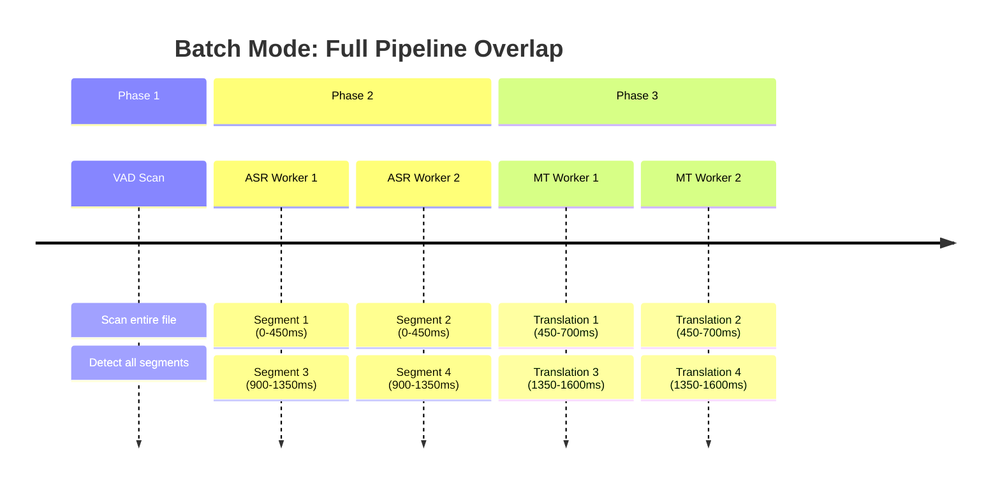
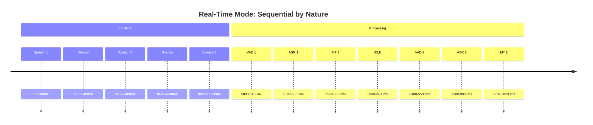
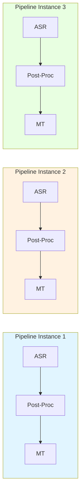
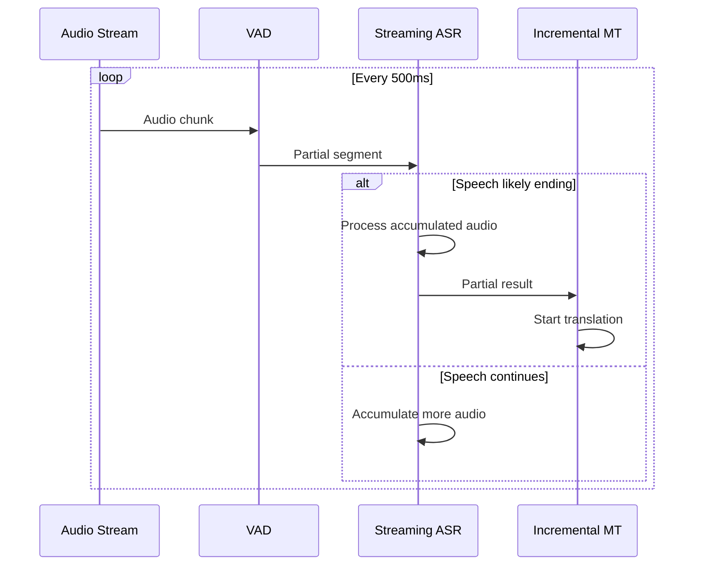
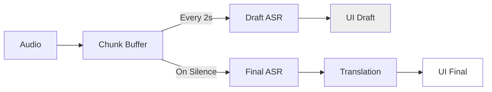

# Task Breakdown and Overlap Analysis for Voice Translation Pipeline

> **Document Purpose**: Detailed breakdown of pipeline stages and analysis of overlapping opportunities
> 
> **Target Audience**: AI systems analyzing parallelization strategies
> 
> **Last Updated**: 2026-02-19

---

## 1. Pipeline Stage Overview


---

## 2. Stage-by-Stage Breakdown

### Stage 1: Voice Activity Detection (VAD)

**Function**: Detect speech vs. non-speech in audio stream

| Aspect | Details |
|--------|---------|
| **Input** | Raw audio chunks (30ms frames) |
| **Output** | Speech probability + start/end timestamps |
| **Model** | Silero VAD v5.1 (ONNX Runtime) |
| **Latency** | ~10-30ms per frame |
| **State** | Stateful (tracks speech probability over time) |

**Current Implementation**:
```python
# Pseudo-code
class VADProcessor:
    def process(self, audio_chunk):
        # Run ONNX inference
        prob = self.model(audio_chunk)
        # Update state machine
        if prob > threshold and state == SILENCE:
            state = SPEECH
            speech_start = timestamp
        elif prob < threshold and state == SPEECH:
            state = SILENCE
            speech_end = timestamp
            return AudioSegment(speech_start, speech_end)
```

**Overlap Opportunities**:
- ✅ VAD can run continuously on incoming audio (already parallel to capture)
- ✅ No dependency on downstream stages
- ⚠️ Stateful - cannot easily parallelize within single stream

---

### Stage 2: Audio Segmentation

**Function**: Package detected speech into segments for processing

| Aspect | Details |
|--------|---------|
| **Input** | Speech boundaries from VAD |
| **Output** | AudioSegment objects (numpy arrays) |
| **Logic** | Merge small gaps, split long segments |
| **Latency** | ~1-5ms (memcpy operations) |
| **State** | Stateless |

**Segmentation Rules**:
```python
# From silero_vad_adaptive.py
MAX_SEGMENT_DURATION_MS = 8000  # Force split at 8s
MIN_SPEECH_DURATION_MS = 250    # Discard if too short
MIN_SILENCE_DURATION_MS = 400   # Merge if silence < 400ms
```

**Overlap Opportunities**:
- ✅ Stateless - can process multiple segments in parallel
- ✅ Trivial overhead - not worth optimizing
- ⚠️ Depends on VAD output

---

### Stage 3: Automatic Speech Recognition (ASR)

**Function**: Convert audio to text

| Aspect | Details |
|--------|---------|
| **Input** | AudioSegment (1-8 seconds, 16kHz) |
| **Output** | Transcription text + confidence scores |
| **Model** | faster-whisper (CTranslate2) |
| **Latency** | ~300-700ms depending on model size |
| **State** | Stateless per segment |

**Model Variants**:
| Model | Size | Latency (typical) | Quality |
|-------|------|-------------------|---------|
| tiny | 39MB | ~150ms | Low |
| base | 74MB | ~300-450ms | Medium |
| small | 244MB | ~800ms | Good |
| medium | 769MB | ~2s | Best |

**Current Sequential Flow**:
```
Segment 1 → ASR (450ms) → Result 1
Segment 2 → ASR (450ms) → Result 2  [Waits for Segment 1 to finish]
Segment 3 → ASR (450ms) → Result 3
Total: 1350ms for 3 segments
```

**Potential Overlap Flow** (Batch mode):
```
Segment 1 → ASR Worker 1 (0-450ms)
Segment 2 → ASR Worker 2 (0-450ms)     [Parallel!]
Segment 3 → ASR Worker 1 (450-900ms)   [Reuse worker]
Total: 900ms for 3 segments (450ms saved)
```

**Overlap Opportunities**:
- ✅ Stateless - perfect for parallelization
- ✅ Compute-intensive - benefits from multiple threads
- ✅ ThreadPool already implemented (2 threads)
- ⚠️ Real-time: Segments arrive slower than processing speed

---

### Stage 4: ASR Post-Processing

**Function**: Clean and filter ASR output

| Aspect | Details |
|--------|---------|
| **Input** | Raw ASR text |
| **Output** | Cleaned text or None (if filtered) |
| **Operations** | Hallucination detection, filler removal, normalization |
| **Latency** | ~1-10ms (regex/heuristic operations) |
| **State** | Stateless |

**Filters Applied**:
```python
class PostProcessConfig:
    enable_hallucination_filter: bool = True  # Detect repetition
    min_confidence: float = 0.3               # Confidence threshold
    remove_filler_words: bool = True          # "あの", "えーと", "um"
    remove_artifacts: bool = True             # "(Laughter)", "(Applause)"
```

**Hallucination Detection**:
```python
def detect_hallucination(text):
    # Pattern 1: Character repetition
    # "ささささささ" → Reject
    
    # Pattern 2: Sequence repetition
    # "hello hello hello hello" → Reject
    
    # Pattern 3: Low diversity
    # "aaaaaaaaaaaaaaaaaaaa" → Reject (<30% unique chars)
```

**Overlap Opportunities**:
- ✅ Stateless and fast - trivial parallelization
- ✅ Can run on ASR output immediately
- ⚠️ Overhead is negligible compared to ASR/MT

---

### Stage 5: Machine Translation (MT)

**Function**: Translate text from source to target language

| Aspect | Details |
|--------|---------|
| **Input** | Cleaned text (1 sentence or short paragraph) |
| **Output** | Translated text |
| **Model** | MarianMT or NLLB-200 (HuggingFace) |
| **Latency** | ~150-500ms depending on length |
| **State** | Stateless |

**Model Types**:
| Type | Use Case | Latency |
|------|----------|---------|
| MarianMT | Paired languages (e.g., ja→en) | ~150-250ms |
| NLLB-200 | Many-to-many (50+ languages) | ~300-500ms |
| Pivot | Unsupported pairs (ja→fr via en) | ~400-700ms |

**Current Sequential Flow**:
```
Text 1 → MT (250ms) → Translation 1
Text 2 → MT (250ms) → Translation 2  [Waits]
Text 3 → MT (250ms) → Translation 3
Total: 750ms for 3 texts
```

**Potential Overlap Flow**:
```
Text 1 → MT Worker 1 (0-250ms)
Text 2 → MT Worker 2 (0-250ms)       [Parallel!]
Text 3 → MT Worker 1 (250-500ms)     [Reuse]
Total: 500ms for 3 texts (250ms saved)
```

**Overlap Opportunities**:
- ✅ Stateless - perfect for parallelization
- ✅ Compute-intensive - benefits from GPU batching
- ✅ ThreadPool already implemented (2 threads)
- ⚠️ Real-time: Texts arrive slower than processing

---

## 3. Overlap Strategies by Mode

### 3.1 Batch Processing (File/Video)



**Batch Overlap Characteristics**:
| Metric | Sequential | Overlapped | Savings |
|--------|------------|------------|---------|
| 4 segments (ASR) | 1800ms | 900ms | 900ms (50%) |
| 4 segments (MT) | 1000ms | 500ms | 500ms (50%) |
| Total pipeline | 2800ms | 1600ms | 1200ms (43%) |

**Why it works**: All segments available upfront → True parallelization

---

### 3.2 Real-Time Streaming (Live Audio)



**Real-Time Overlap Characteristics**:
| Metric | Value | Explanation |
|--------|-------|-------------|
| Segment arrival rate | 1 per 3-8s | Human speech speed |
| ASR processing time | 0.3-0.7s | Faster than speech |
| MT processing time | 0.15-0.5s | Faster than speech |
| Worker idle time | 80-90% | Waiting for next segment |
| Actual overlap | ~0ms | No concurrent segments to process |

**Why overlap fails**: Segments arrive slower than processing speed

---

## 4. Granular Overlap Possibilities

### 4.1 Inter-Stage Overlap (Pipeline Parallelism)



**Analysis**:
| Scenario | Batch Mode | Real-Time Mode |
|----------|------------|----------------|
| Segment N in ASR | Yes | Yes |
| Segment N-1 in Post-Proc | Yes | Yes (briefly) |
| Segment N-2 in MT | Yes | Rarely |
| Overlap benefit | Significant | Minimal |

**Key Insight**: In real-time, by the time Segment N finishes ASR, Segment N-1 has already finished MT (MT is faster than ASR). So no actual overlap occurs.

### 4.2 Intra-Stage Overlap (Data Parallelism)

**Within ASR Stage**:
```python
# Batch multiple audio segments
def asr_batch(segments: List[AudioSegment]) -> List[str]:
    # CTranslate2 supports batch inference
    return model.generate(segments, batch_size=4)
    # Batch of 4: ~600ms total (vs 4×450ms = 1800ms sequential)
```

**Within MT Stage**:
```python
# Batch multiple texts
def mt_batch(texts: List[str]) -> List[str]:
    # MarianMT supports batching
    return model.generate(texts, batch_size=8)
    # Batch of 8: ~400ms total (vs 8×250ms = 2000ms sequential)
```

**Applicability**:
| Mode | Batch Size | Benefit |
|------|------------|---------|
| Batch (file) | 4-16 | High (4x throughput) |
| Real-time | 1 | None (segments arrive one by one) |

### 4.3 Streaming Overlap (Incremental Processing)

**Concept**: Start processing before segment is complete



**Stages for Streaming**:
| Stage | Can Stream? | Challenge |
|-------|-------------|-----------|
| VAD | ✅ Yes | Already streaming (frame-by-frame) |
| ASR | ⚠️ Partial | Accuracy drop on incomplete audio |
| Post-Proc | ❌ No | Needs complete text for filtering |
| MT | ❌ No | Context-dependent, needs full sentence |

---

## 5. Overlap Efficiency Matrix

### 5.1 By Stage and Mode

| Stage | Batch Overlap | Real-Time Overlap | Bottleneck |
|-------|---------------|-------------------|------------|
| VAD | N/A (streaming) | N/A (streaming) | Audio arrival |
| Segmentation | Low (too fast) | Low (too fast) | VAD output |
| ASR | **High** (~50%) | **None** (~0%) | Segment arrival |
| Post-Processing | Negligible | Negligible | ASR output |
| Translation | **Medium** (~40%) | **None** (~0%) | ASR output |
| Output | N/A | N/A | MT output |

### 5.2 Worker Utilization

```
Batch Mode (4 segments):
┌─────────────────────────────────────────────────────────┐
│ ASR Worker 1: [████SEG1████][████SEG3████]    100% busy│
│ ASR Worker 2: [████SEG2████][████SEG4████]    100% busy│
│ MT Worker 1:  [██SEG1██][██SEG3██]            100% busy│
│ MT Worker 2:  [██SEG2██][██SEG4██]            100% busy│
└─────────────────────────────────────────────────────────┘
Total time: 900ms (vs 1800ms sequential)

Real-Time Mode (4 segments):
┌─────────────────────────────────────────────────────────┐
│ ASR Worker 1: [████SEG1████]....[████SEG2████]....     │
│              0-0.45s           5.4-5.85s                │
│ ASR Worker 2: [idle.............................] 0%   │
│ MT Worker 1:  [██SEG1██]....[██SEG2██]....              │
│              0.45-0.7s      5.85-6.1s                   │
│ MT Worker 2:  [idle.............................] 0%   │
└─────────────────────────────────────────────────────────┘
Total time: 6.1s (constrained by speech duration)
```

---

## 6. Optimization Recommendations

### 6.1 For Batch Processing

**Priority: HIGH** - Significant gains possible

```python
# Current: Sequential
for segment in segments:
    text = asr.transcribe(segment)
    cleaned = postprocess(text)
    translation = mt.translate(cleaned)

# Optimized: Parallel with overlap
from concurrent.futures import ThreadPoolExecutor

with ThreadPoolExecutor(max_workers=4) as executor:
    # Stage 1: Parallel ASR with batching
    asr_results = executor.map(asr.transcribe, segments, chunksize=4)
    
    # Stage 2: Parallel post-processing
    cleaned = executor.map(postprocess, asr_results)
    
    # Stage 3: Parallel MT with batching
    translations = executor.map(mt.translate, cleaned, chunksize=8)
```

**Expected improvement**: 40-50% reduction in total processing time

### 6.2 For Real-Time Processing

**Priority: LOW for overlap, HIGH for latency** - Different optimizations needed

Since overlap doesn't help, focus on:

1. **Reduce segment duration**:
   ```python
   MAX_SEGMENT_DURATION_MS = 4000  # Instead of 8000
   # Sacrifice: More frequent translations (more MT calls)
   # Benefit: Lower per-segment latency
   ```

2. **Streaming ASR** (if quality acceptable):
   ```python
   # Process every 2 seconds instead of waiting for silence
   # Trade-off: Context loss vs. Lower latency
   ```

3. **Speculative execution**:
   ```python
   # Predict speech end, start ASR early
   if speech_duration > 3s and pause_probability > 0.8:
       start_asr_early()  # Risk: May need to restart
   ```

4. **Pre-warming models**:
   ```python
   # Keep models in GPU memory
   # Avoid: Loading overhead between segments
   ```

---

## 7. Summary Table

| Aspect | Batch Mode | Real-Time Mode |
|--------|------------|----------------|
| **Data availability** | All segments upfront | Segments arrive sequentially |
| **VAD pattern** | Scan entire file | Streaming frame-by-frame |
| **ASR parallelism** | ✅ 4x with batching | ❌ 1x (segments too slow) |
| **MT parallelism** | ✅ 8x with batching | ❌ 1x (segments too slow) |
| **Inter-stage overlap** | ✅ Significant benefit | ❌ Minimal benefit |
| **Primary bottleneck** | Compute | I/O (audio arrival) |
| **Optimization target** | Throughput | End-to-end latency |
| **Overlap savings potential** | 40-50% | ~0% |
| **Recommended strategy** | Max parallelism | Streaming + prediction |

---

## 8. References

- VAD: `src/audio/vad/silero_vad_adaptive.py`
- ASR: `src/core/asr/faster_whisper.py`
- Post-Processing: `src/core/asr/post_processor.py`
- Translation: `src/core/translation/marian.py`, `nllb.py`
- Pipeline: `src/core/pipeline/orchestrator_parallel.py`
- Overlap Analysis: `docs/overlap_think_on_real_time_translator.md`

---

## 9. Update: Hybrid Streaming Solution

Based on evaluation of architectural suggestions, the recommended approach for real-time is **Hybrid Streaming Mode** (not full streaming rewrite).

### 9.1 The Solution



### 9.2 Overlap in Hybrid Mode

| Stage | Draft Mode | Final Mode |
|-------|------------|------------|
| **ASR** | Overlapped (every 2s) | Sequential (on silence) |
| **MT** | Skipped (unstable) | Sequential (after ASR) |
| **UI** | Show grey draft | Show black final |

**Key Insight**: Only ASR drafts overlap; MT waits for final to preserve quality.

### 9.3 Implementation Roadmap

See detailed plan: `docs/design/streaming_latency_optimization_plan.md`

| Week | Task | Deliverable |
|------|------|-------------|
| 1 | Metrics + Config | TTFT/Lag metrics, segment=4s |
| 2 | StreamingASR | Draft every 2s, final on silence |
| 3 | UI + Integration | Grey drafts, bold final, toggle mode |

### 9.4 Expected Results

| Metric | Current | Hybrid Mode | Full Streaming |
|--------|---------|-------------|----------------|
| TTFT | 5000ms | 2000ms | 1500ms |
| Quality | 95% | 95% | 85% |
| Complexity | Low | Medium | High |
| **Recommended** | - | ✅ **Yes** | ⚠️ Risky |

---

*Document for AI analysis of parallelization strategies.*  
*Updated 2026-02-19 with hybrid streaming solution.*
